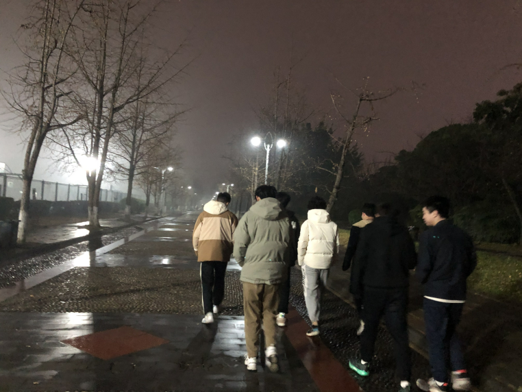

# 2024-01-01-第一顿晚餐

你好...2024..我们见面了,,,新的一年,,还请多多关照,,,,

早上起的比较晚,,,也没有吃早餐,,

在寝室呆了许久,,然后中午去吃个饭,,,,

随后就去实验室了,,,,

在实验室,,整个一天也没有干什么,,,主要是复习一下以前的笔记

也就那么一篇笔记,,再去看的时候,也已经忘完了,,,

所以花了整整一天时间又消化了一遍...

晚上,,出去吃饭,,,

2024.01.01 这是元旦,,虽然节日在我们眼里也显得不那么重要了....

只是关心放不放假,,,

放假了,,,该怎么过,,按照什么习俗,,我反正是不关心的,,,

但是,2024年,第一顿晚餐,,必须吃好点,,,

于是跟着学弟们一起去"老地方家常菜"吃饭

我点了一个"蒜泥白肉",这是每次去都必点的,,,只能说味道还好,,肉很多,,还不错

同时也比较喜欢吃 "虎皮青椒"..其次是"紫菜汤"

其它菜都是寥寥夹几筷子,,,

当时有一个"青椒回锅" 我感觉蛮不错的,,,油很多

青椒很大,,,和虎皮青椒有得一拼,,,,回锅肉也很香,,基于高度评价

吃完饭,,我第一个走出饭店,然后在外面驻足等待他们

在外面看"螺蛳粉"店的大屏幕电视广告

然后,,走在银杏大道上,回实验室

回到实验室后,,显示刷了好久的抖音,,然后学习