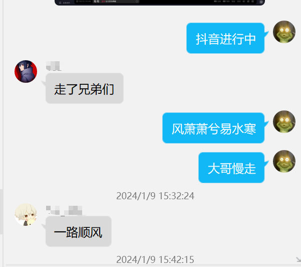
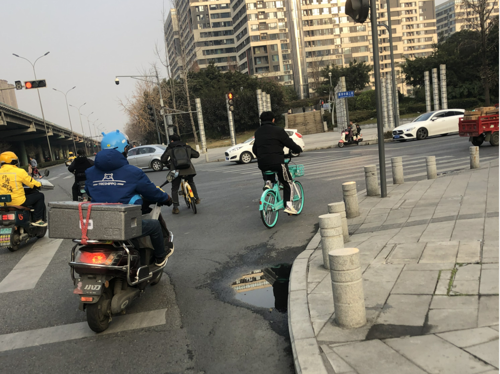
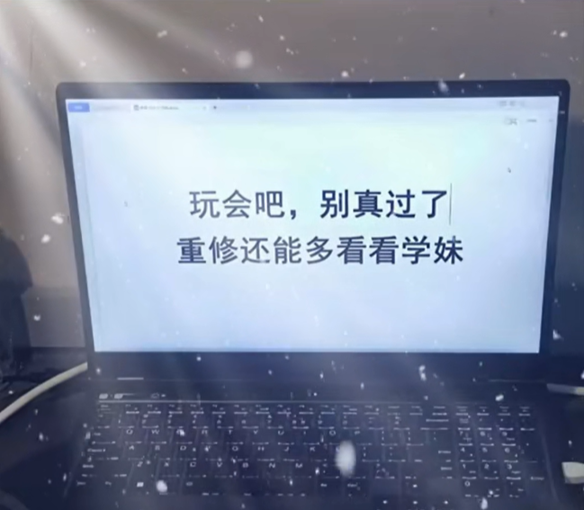

# 2024-01-09-周二

今天上午考 毛概

所以,,就考呗...

其实我是想快点交卷的,,,,在30min之内解决它..

虽然我只预习了半天.😁

考的内容大多数有点印象..但是也是属于不记得..

所以就直接乱编了,,,

`心中有党,,,成绩理想`

考完毛概后,,,所有考试就都结束了,,所以...放假....

学校的标准放假时间应该是18号..

当然可以提起离校...

就今天中午,,我就看见有人拖着行李箱回家了,,,,

对了,,,突然想起来了,,,今天ice大哥要回上海了,,

所以今天中午他要请我们吃饭,,,,

本来我去不,,,我室友也是今天离校,,和室友一起吃中午饭,,,但是室友走不了

我就去陪ice他们吃饭了,,,,

中午吃的"老地方家常菜"

点了"蒜泥白肉,水煮肉片.凉拌xx,xx炒xxx"

然后还买了一瓶大瓶的果粒橙

果粒橙大家没怎么喝...最后ice提回寝室了

于是..ice今天就坐飞机走了...

我下午好像没怎么学习...

也忘了干了什么....

下午要去陪室友吃饭,,,,

和室友吃饭是一学期只有2次的样子,,开学一次,,,走之前一次

下午我和室友吃饭..

这一次我们去的有5人,,,,虽然寝室只有4人

多出来的是苏浩的好朋友...当然也是我们的大学同学,,,

然后我们骑自行车去吃饭的地方

目的地是"矮板凳"...一个吃火锅的地方,,听说很好吃,,,每一次去都是排队,,,很多人...

所以,,,,这一次...苏浩强烈建议去,,,

于是我们就去了....

在去的路中,,我记得苏浩骑自行车行驶有点彪悍

一些路段,,,应该是机动车走的..苏浩也是直接骑过去

去的路上一直是苏浩在带路,,,

可能是因为苏浩之前跑过外卖,,,对路线比较熟悉,,,,他带的路感觉我都不认识

可能是比较偏僻的最优路线吧....

然后我们就到达了目的地---矮板凳火锅

然后就是常规操作,,涮火锅....

这一次..我打碟比较清淡,,只放了香油和盐,,,感觉盐放多了

然后盐无法和香油很好的融合,,,

当我把烫好的血旺在我的碟里面涮一下后,,入口,,,

有点咸....

矮板凳的火锅,,感觉没啥特点,,,,虚有其表...不如学校附加的老兵串串,,,

我记得我吃了很多锅边馍....锅边馍比较热乎,,口感不错,,有点甜

去排了3次队,,,第一次给他们排队拿锅边馍,,一次只能拿4个

锅边馍是相关师傅现做的,,,

然后我又再去排队拿锅边馍,,,,自己吃了3个,,,,

后来我又去排队拿锅边馍,,,,大概吃了5个锅边馍...

火锅吃完后,,,我们就回学校了,,,,

为了方便消化,,我们是走路回去的....

回学校后,,,我去了实验室,,,没回寝室..可能是因为我的电脑在实验室吧

回实验室后,,,没怎么学习,,,,大概是8:00差不多吧...已经忘了

回实验室后,,,就刷抖音,,,然后小小的趴着睡了一下,,,

最后才开始学习,,,

然后10:40的样子就回寝室,,,,

下面是刷抖音,,,印象比较深刻的截图

我操作系统挂科了,,,,别怕...

