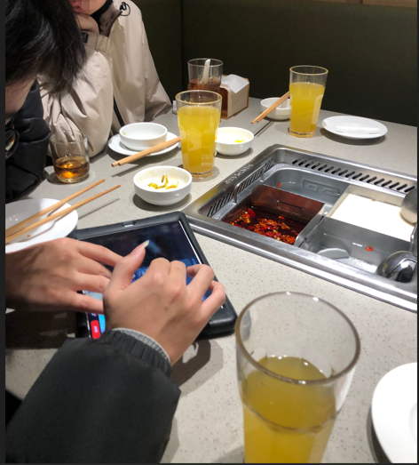
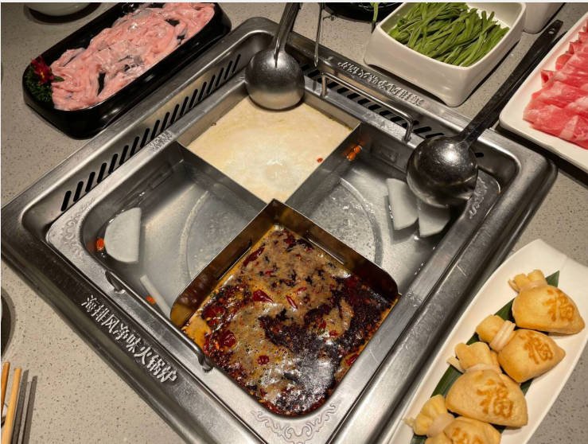
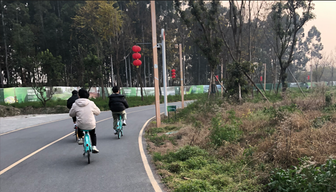

# 2024-01-10-周三

上午起的不是很早...

今天要去找初中同学玩...他们约好的,,,,

目的地是西南交通大学犀浦校区...

我大概是10:00出发,,,先是打车到华兴地铁站,,然后做地铁到目的地

# 我是傻逼

我上地铁的时候,,先是用的天府通的乘车码.,,好像是我的操作不对吧,,,

然后打开了一个成都地铁乘车码,,,,然后也不知道最后使用了哪一个乘车码...就迷迷糊糊上了地铁,,,

做了很久的地铁,,转乘之类的

最后到达目的地,,刷乘车码出站的时候..使用了主界面的成都地铁乘车码

上面写在: 请不要混用乘车码

我然后就刷了乘车码,,迷迷糊糊的出站了...

可是我发现不对劲,,,因为出站的时候,刷成都地铁乘车码,,显示行程开始,,,意思是我没有出站,,

这意味这我地铁进站刷的是天府通的乘车码,出站刷的天府通的乘车码

g,g,g

我出站了,,地铁没有扣费,,,因为我开启了2个行程,,都没有结束,,,,

我担心我2个行程没结束,,会扣我很多费用,,于是我去询问地铁站的客服人员如何解决

和客服人员说了很久,,,,我提议让我进站刷一下乘车码,,结束其中一个行程,,,

客服人员不同意,,,告诉了我合理的解决办法,,,

但我还是很想进去刷了一下乘车码,,结束一个行程..但是客服人员还是不同意

于是我就离开了地铁站,,

出站后,,,我感觉还是不对劲,,所以我打了成都地铁的客服热线,,然后询问了人工客服

人工客服提出的解决办法和地铁站的工作人员是一样的,,,所以就那样了,,等待3-4天,,执行他们的解决办法

我也问了工作人员,,这是否会影响我之后的地铁乘车,,他们说不影响,,那就太好了...

# 张sir手机丢了

这一次我们一起聚会的有4人,,,

我们到达西南交大的时候,,,,张sir匆匆的跑出来接我们

说他手机落在什么地方..不见了,,,但依稀记得在哪里落下的,,,,

于是我们也陪伴张sir找手机,,,比如去监控室,,,,但是时间到了12:10吧,,,相关人员下班了,,,,

之后我们也去帮过张sir找手机,,,都未果,,,

比如再次去监控室

比如多次给他遗落的手机打电话

比如骑车自行车去看看路上

比如去教室看看

比如去问问司机...因为张sir认为他可能是在校内的车上掉的..

但最后都没有结果...

# 第一次吃海底捞

海底捞要下午2:00才打折,,

我们先是在校园逛逛,,,这是我二次来西南交大

但是还是很震撼,学校好大,,路好宽,,风景也还不错,,,

路上的学生,,,,形形色色

差不多13:20的样子,,我们去海底捞了,,,先是去里面坐着...

服务员也是允许我们先进去坐着,,等到14:00再开始点餐,,,,

里面服务感觉真的不错,,,

我们先在里面入座,,然后点了饮料,,他的意料好像是5-6元一杯

饮料可以无限续杯,,,也可以加冰块

饮料续杯是服务员主动续,,,当他发现你的杯子不是满的,,就给你续上

感觉有点没必要,,我还没喝到一半,,就又满上了,,毕竟别人主打就是一个服务吧

海底捞有什么特色呢?

首先是服务好,,,,然后是食材还好吧,,我们点了很多菜..同时味道也不错

在服务员服务的过程中,,收拾垃圾,,,不小心把一个芹菜碎屑弄进汤锅了

然后问我们是否需要换锅底,,,我们回答说不需要的,,,其实没啥问题

之后想想还是很想换一个新鲜的锅底,,,因为那个犊子鸡汤很鲜美

但是后来,,服务员过来道歉,,说给我们某一道菜免单,,,弥补之前的过错...

最后我们吃了300多,,,人均90的样子吧...

# 骑行绿道

本来这次聚会是先骑行绿道的,,,但是张sir上午考试...11:30才结束,,

所以延后了,,下午去绿道,,,,

我们从西南交大附近吃海底捞的地方,,打车去往绿道附近

下车的时候,,我们还不知道怎么上绿道,,,,最后通过路人上了绿道,,,

然后就是骑行喽

豆+Ag对绿道骑行的评价是:"很舒服,惬意,,风景很好"

我们差不多骑了2小时,,,

然后我们就在绿道附近寻找离开点,,做地铁回西南交大,,

寻找绿道离开点过程也是艰辛,,我们找不到路线驶离绿道,,,导航也是奇奇怪怪

最后我们还是跟着导航找到了路线,,,,有些路段还是不好骑的....

最后离我们学校差不多5~10公里的样子,,,,我提议去我学校看看,,,他们说算了...

然后我们就扫码关闭共享单车,,,,

这里我也是遇到了一点问题,,,我的halo单车找不大服务区停车点,,我们的位置同时比较偏僻,,

导致无法停车,,,否则就会扣20元,,,光停车我就难受了一会儿...

最后也是在张sir的帮助一下,神奇的解决了,,,

他们的单车比较好停,,随便一个地方貌似都可以停,,但是halo单车比较严格

停了单车后,,我们就打车去最近的地铁站,,,

然后我们就坐地铁回西南交大

# 免单的晚饭

回西南交大后,,我们吃的干锅,,,

因为LiuXing同学建议吃这个,,,他之前来吃过,,,感觉很不错,,这个干锅在位于学校里面...

找到地点后,,我们就去点菜,,然后开吃

菜上了后,,我感觉一般,,,,不如我们学校附近的鸡公煲

然后就开吃,,中途我还点了一瓶啤酒,,和豆+Ag一起喝完了,,,,

不幸的是,,,吃的过程中

LiuXing同学吃到了一个烟头,,,,也就是香烟的吸嘴的某个部位,,大概有0.5cm那么长,,被LiuXing同学吃到了

迟到烟头后,,LiuXing同学是非常小难受的,,,比较生气,,,

然后,LiuXing同学提议给老板说一下,,,我表示算了吧,,,,可能是因为迟到烟头的不是我,,,没啥感觉

然后LiuXing同学和张sir就去找老板娘了,,,

我和豆+Ag就慢悠悠的吃,,,

当LiuXing同学和张sir和老板娘他们商议完毕,,出来后,,

LiuXing同学和张sir就喊我们走,,,我问饭钱怎么办

张sir说,,直接免单了,,,,

根据LiuXing同学和张sir的描述,,,当时老板娘比较的紧张,,,语无伦次,,,

一会儿说烟头来自xxx,,一会说烟头是来自xxx的

然后说饭钱就少给点,,,张sir认为不行,,,给老板提出免单

老板娘可能因为理亏,,于是就答应了,,,

然后我们就离开了饭店,,,,

最后只能说是难受了LiuXing同学,,让他吃出了烟头,,

然后我们搭建免单了

# LiuXing同学的离开

吃了晚饭后,,,大家差不多要回学校了,,,

先是豆+Ag明天的火车回家,,今天晚上要回去收拾行李....

然后张sir认为好不容易聚一下,,,要多玩一下,,,晚上11:00再坐车回去,,,,

同时LiuXing也建议豆+Ag多待一会,,,晚点再走,,,

最后的解决是,,,

我和豆+Ag都把火车票给退了,,,,多玩一会儿

但是LiuXing却走了,,,,,明明他还是劝大家多玩一会儿的人,,到最后他最先离开

因为他明天学校有个实验,,,要赶回去搭建环境准备之类的

# 晚上喝酒打牌

LiuXing走后,,,我们三思考着玩什么

张sir建议 KTV唱歌,喝酒,

我和豆+Ag对此不感兴趣,,,

我认为喝酒比较伤胃,,然后我讨厌唱歌,,,自己唱歌难听死了,,,

然后我们在街上找了一个一个长椅,,走累了,,,坐着摆龙门阵

最后我们的玩法是, 买酒,买零食,买烧烤,,打扑克.住酒店,,,

于是我们就行动,,,先是去西南交大的批发部买酒买零食,卖烧烤

张sir推荐买"真露"的酒,,,,他说很好喝,,,于是他买了2瓶,,我买了2瓶,,豆+Ag买了1瓶

这种酒一瓶就需要12快的样子,,,,

之后我们打开喝"真露"的时候,,,woc,,,难喝死了,,,,像喝威士忌一样难受,,,但是没有威士忌那么超级难受

于是酒没喝几下,,最后一口闷,,喝完一瓶,,,就不喝第二瓶了,,,

我们去酒店的路上也出了一些问题,,

就是豆+Ag停共享单车也出了问题,,死活停不了,,,

我先是打了车,,车来了,,,但是豆+Ag还是无法停车,,

司机很不耐烦,,于是我就取消了订单,,帮忙把共享单车给停了,,,

最后折腾了很久,,终于把车停了,,

然后我们又打车去酒店,,,,

张sir看见多好情侣进酒店,,很羡慕,😛😛😛😛

因为我们折腾了很久,,,去酒店后,,烧烤豆都凉了,,不好吃,,,

之后,,我们就打扑克....斗地主

对了,,张sir说我订的酒店怎么在犀浦夜市,,,一个很乱的地方,,都是卖p的地方,,我表示不知道,,,,

# 第二天

我们是10:00的样子醒的

我上了2次厕所,,肚子不舒服

然后开了电视...看着看着又睡着了,

# 吃早餐

我们12:00的样子,离开了酒店,,,

找了一个地方吃早饭,,,,

我们吃的小笼包,,感觉很不错

他们先是点了鲜肉的小笼包,,,基本上好像是一笼8元

鲜肉的小笼包很好吃,,,咬上一口还爆汁水

然后上了芽菜的小笼包..感觉比较难吃

吃到最后,,我们的稀饭喝完了,,稀饭2元一碗,,我们很想喝第二碗稀饭

但是好贵,,,不想续第二碗,,,

最后张sir问了老板娘,,老板娘说续稀饭不要钱

于是我们就开心的续上稀饭,,,稀饭真不错,,,,

# 第一次进成人用品店

吃了早饭后,,张sir带我们看看犀浦夜市,,,

路上很多足浴店,我还记得几个名字, "姐妹足浴","温雅足浴"

路上还有很多广告,,比如学妹上门,微信xxx

我们去了成人用品店,,,第一次去

进去了,,看了很多成人用品,,,比如男生的用品..女生的情趣用品

里面的东西好贵,,,,我们去逛了2个成人用品店,,,

其中张sir说,,要买就买贵的,,,买便宜了用着又不舒服

# 回学校,,继续打扑克

我们打车回到学校,,

找了一个湖边的草滩上,,然后打扑克,,,

湖里湖边有黑天鹅,白天鹅

所以岸边有鹅屎😥😥😥😥

我们找了一个稍微干净的地方打扑克,,,

本来张sir建议输了喝酒,,,因为我们没喝完,,,特别是豆+Ag喝了一般,,没喝完的

那瓶要解决掉的

但是我和豆+Ag没同意,,因为那东西太难喝了

打了许久扑克牌,,,差不多3:00吧,,,我们就去帮助张sir调监控找手机

# 离开

帮助张sir调监控找手机后,,,还有询问司机之类的

张sir的手机寻找未果,,,,

然后我们就要离开了,,但是张sir还是很想挽留,,,可能他比较喜欢玩,,同时好不容易聚一次,,,

张sir要送我们进入地铁站,,因为我们带了没喝完的酒,,不知道酒能不能带进地铁站

如果带不进的话,,,需要送给张sir自己慢慢喝

在地铁站,,,我们发现可以带进去,,,,然后我就处地铁站给张sir扫一辆单车,,,然后我让豆+Ag先走一步

但我和张sir离开地铁站给他找单车时,,张sir就说:"这下子豆+Ag走了..我们去继续喝酒".

只能说,锤子,,,难喝死了,,太累了,,,我要回家了,,,,

给张sir扫了单车,,我继续回到地铁站,,,继续尝试酒水,,,然后同意带进去

当时安检员还问我:"你是不刚才进去了吗".

我确实进去了,,但是又出去了,,因为要给张sir扫单车..

当我完全进入地铁站时,,发现豆+Ag还在等车,,,因为地铁还没进站,,,笑死😄😄😄

然后就回学校喽