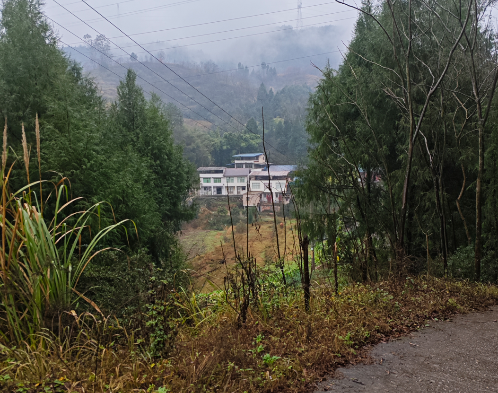

距离上一次写日记,,可能是在很久之前了,,,,

因为日记涉及别人隐私什么的,,,,可能对以后的工作什么的造成影响,,,

但我还是不想关闭日记的page服务,,,

于是我创建了一个新的GitHub账号,,,把日记什么的放在了新的GitHub账号里面了

继续回来写日记吧,,,我都忘记我要说些什么了...

大概是9号的样子,,,学校考完了最后一门考试

然后我订了11号的火车票...

因为其它原因,,,我退票了,,然后订了18号的火车票...

回家后,,,感觉很不好,...

这就是目前我的老家,,,,雾蒙蒙的,,,

好像才下过雨,,,路有点打滑,,,,最近一直都是绵绵细雨,,,草了,,,雨要下不下的

家里有一位半瘫痪的奶奶,,,,生活不太能自理,,,

家里很冷,,,相比于成都的话,,,,

冷到什么程度...其实也就有点小冷

早上基本上是很难起来,,,就是那种冷得刺骨,,,

晚上,,,睡觉,,,头露在外面都是很冷那种,,

在家中,,,前几天我偶尔会花点时间打扫卫士,,,

家里简直脏得不得了,,,,锅碗瓢盆什么的,特别脏...😔烦死了,,回到家每一次都是难受至极

这种家,,,给我的感觉就是,,,累赘,,不回也罢,,,

但迫于当前状况,不得不回家

我奶奶平时吃饭的碗,,,就是洗都不洗的那种,,,,虽然奶奶她本来就没有那个身体条件去支持她洗碗

我奶奶差不多是我外婆在照顾,,,但我外婆也只是送饭过来,,,所以谈不上什么照顾吧..

在家里,,我一日三餐都要给奶奶做饭,,,

我平时是一个讨厌做饭的人,,,

自己做的饭,,就那种自己都认为超级难吃的那种,,,

而且我认为做饭很浪费时间...

就这几天来看吧,,,做饭,,吃饭,,,洗碗,,差不多花我1.5小时,,,,

天哪,,,我简直糟糕透了,,,,...一天3次做饭,,差不多花我4.5小时

我就以今天为例子吧,,,,早上差不多8:00起床

我奶奶每一次都要叫我起床,,烦死了,,,,,

每次差不多到了饭店也是吵着我做饭,,,,

我早上差不多8:10去做饭,,,

先烧洗脸水给我奶奶,我?差不多很多天没洗脸了....

然后电饭煲煮干饭,,然后炒鸡蛋,,,然后理菜叶,,然后烧汤

然后巴拉巴拉,,然后吃饭,,我吃完了,,等我奶奶吃完,,然后给她洗碗,,,

前前后后到9:30的样子,,,我搞完了,,,然后上楼打开电脑,,,

这样的生活简直不要太难受,,,,

再谈谈自己的状况吧...

早上差不多8:10起床,,,

偶尔午睡到3:00的样子,,

晚上也是9:00~10:00就睡了,,,

学习不是很给力,,,,

家里连学习的地方都没有,,,其实也不是没有,,,只不过没有像样的桌子和板凳罢了...

偶尔坐在床上学习,,,偶尔把电脑放在桌子上学习,,坐在桌子,,,手就很冷,,,板凳也是很简单那种,,,没有椅子,,QAQ

距离寒假结束,,差不多有32天的样子,,,

这期间,,,我要留点时间准备我的`计算机组成原理`补考...差不多六7天吧...

虽然这7天,,我可能不会全部用来复习,,但是重点仍然是复习

所以我整体的时间是32-7=25

这25天,,,怎么安排呢?

这25天,,也不全是我个人的...

比如要过年,,比如是否要走亲戚,,,

比如还要到处去吃席,,,就过不了多久,,我可能要去市里面吃席,,,还要去2次,,,

但,,,只能说,,,该推掉的推掉,,,不能推掉就只能去了,,,,

所以我的时间是小于25天的,,,

这25天,,,我前期仍然是学习别人的博客,比较随意的学

后期的话...

- Linux恶意代码编写
- Windows游戏逆向
- 样本分析
- 这上面的3个,,,可能不太能完成,,试着去完成吧

回到学校后,,捡起学过的pwn

所以,,,差不多就是前面10天的样子,,,,后面15天的样子,,,,

最后7天松散一点,,,复习复习,,玩玩,,,学学吧,,,

