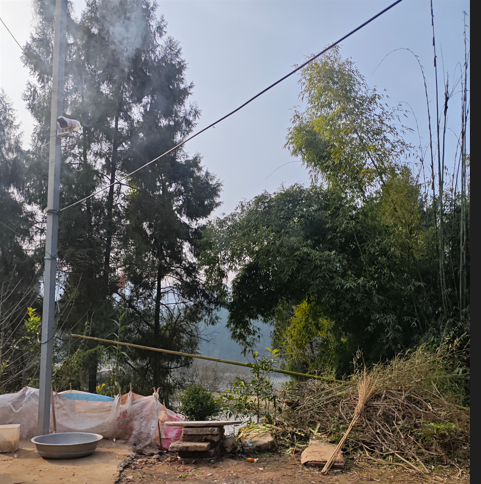

距离上一次写日记,应该是很久之前的事情了

因为去干爹那里奔丧,,然后回家,到家后也不想怎么动了....

其实,家里挺悠闲的,,,

有那种 陶渊明的"采菊东篱下,悠然见南山"的感觉

悠然自得,悠哉游哉...

于是,,,我突然想摆烂了,,,

想赏天阅地,想睡在阳光下,

想听鸟语,想闻花香

想赶着大鹅,想喂着鸡鸭,,

想摸着小狗,,想拉着猫咪,,,是呀,,,多么的悠然自得,,,

在逛boss直聘期间,,我看到了其它工作,,,

于是我的内心开始动摇了,,在干爹家期间,,我干爹就给我说了一些其他人找工作的情况

期间也谈到,,在大学学了什么,,出来也不一定是干那个,,

当时我的回答是:"那得都没意思".

在大自然中悠闲几天后,,我内心动摇了,,,

以后干技术,,肯定很累的,,,很辛苦,,并且高强度持续的学习,,,,

那么,,我那时会不会过得快乐,开心呢,,

好了,,就说到这里吧,,,感觉不知道以后的路怎么走

技术比较有趣😁还是会一直搞得,,,,但是拿他吃饭,不好说......