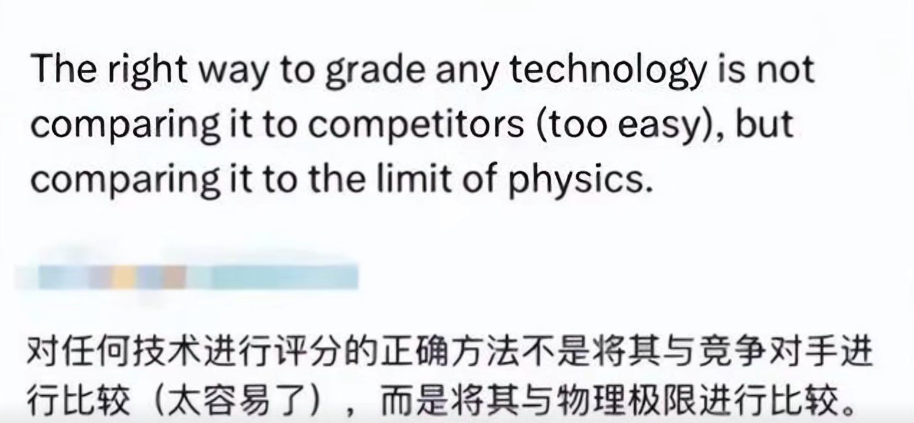

# to-do-list

- 运动 ✔
- 阅读4h❌ 大概只看了3.x个小时
- 背诵道德经x5 ❌
- 清单饮食 ✔

# 如果这一天重来，我会做出什么改变

1，不会看那么多颜色视频了

如果说整个犯罪过程是 有想法--> 看图片-->看视频 --> 开导。

那么我们应该在“想法处”采取行动。当效果执行得不错的时候，我们再再看视频处训练自己吧

2，上午看书不够专注，有点分心。

3，出去打球不会穿平时装了，而是运动装。把衣服弄脏很不好。可是我没有运动装，考虑是否要buy

4，应该多利用一些xx去锻炼自己了，书看得再多，得实践起来。

# 一些零碎的想法

> 今天刷了一个商品，让我大震惊

主要讲的是小米su7 在参数上对标了特斯拉汽车Model-3。在参数上，小米90%都做到领先于特斯拉。

对此马赛克的回答，显得非常有格局。

在创新方面，小米无法比拟。

感悟：

我只能说，这回答非常的棒。展现了特斯拉汽车的优点，批评了小米汽车的不足。

如果从理性的角度去思考这种回答，我们应该这么去构架这种思维?

发现自己的优势？并和对方的缺点联系起来？

>古人云，行百里者半九十。

大概的意思是100里的路，走到了90里，就走不动了。亦可比喻为 半途而废，中途放弃。

道德经第64章：民之从事，常于几成而败之。慎终如始，则无败事。

大概的意思是，众人做事常常在快要接近成功的时候惨遭失败。在事情快要做完的时候还像一开始时候那样谨慎、慎重，就不会有失败。

这不禁让我想起了自己放弃学习技术。于是思考着，我是不是也是“行百里者半九十”的一份子呢。

如果说“合抱之木，生于毫末；九层之台，起于累土；千里之行，始于足下”，那么我只能说，技术并不是我的目的或者终点，亦或者说，此刻我是这么想的。

九层之台，起于累土，我也不想在技术这方面去砌一种楼墙。

千里之行，始于足下，可能自己千里之行的目标点不在技术。

志不在江河，而在大海。

那么我的大海是什么呢？虽然不知道喜欢什么，但是知道自己不喜欢什么。
