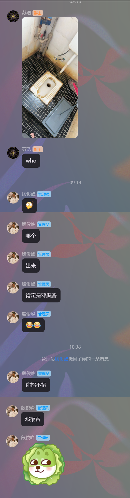
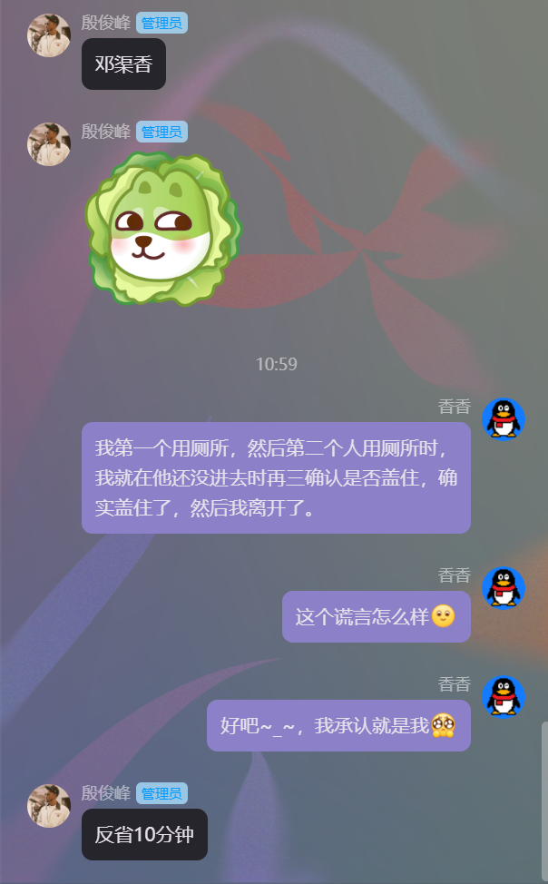

# to-do-list

😁😡

- 运动 

- 清单饮食 

- 国学经典 ：诗词+...

- 学English

- 阅读4h+ 

# 叙事

> 描述这一天都干了什么

　　上午，又因为厕所的事情让我很不爽。我是第一个用厕所的，第二个是谁，我不知道，反正１００％我是盖了盖子，关了门的。因为第二个人上厕所时，等他还没有进门，我就马上跑过去看看我是不是真的盖住了，答案是我确实盖住了的。然后我离开了寝室。

　　在图书馆的时候，寝室群里苏室友问谁又没关盖子，于是发生了让我很不爽的事情。

　　我在１０：３８发了一句“６”，以表示不服。然后不知道哪一个管理员（盲猜殷同学）撤回了我的消息，然后禁言我１０分钟。禁言结束，我继续发消息。

　　话虽然是那样说的，但是我得表现出我是故意背黑锅的。

# 思考

> 如果这一天重来，我会做出什么改变

