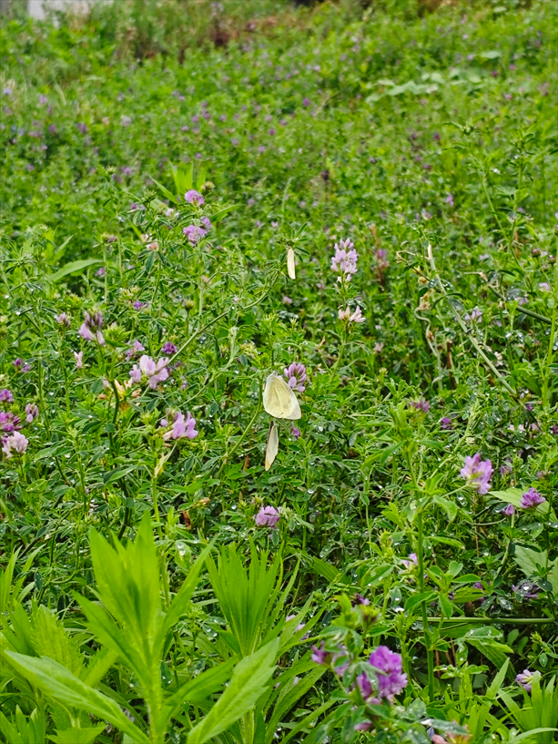
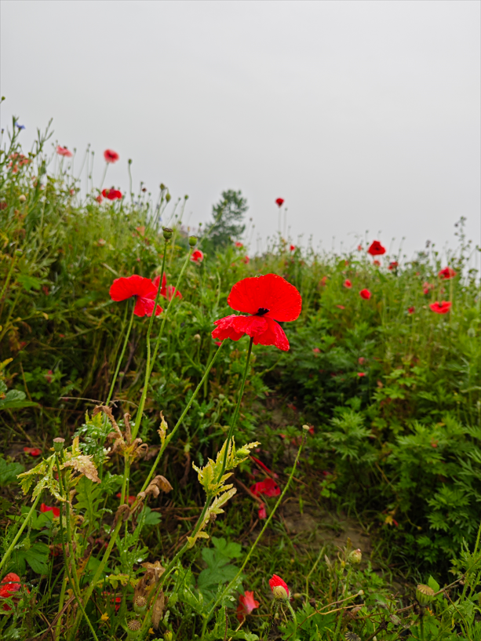
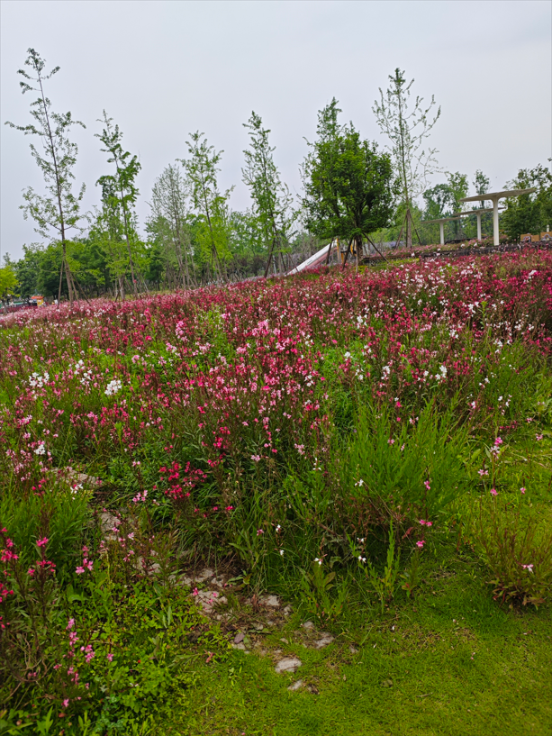
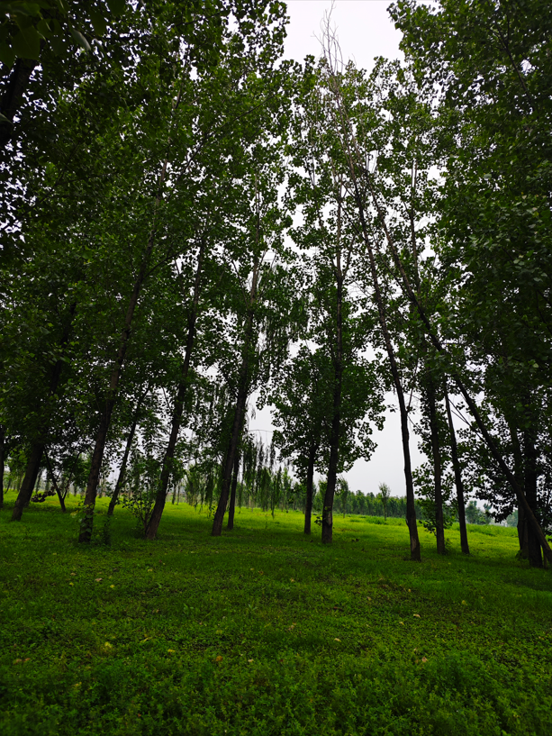

# to-do-list

😁😡

- 运动： 😡最近天气不好，没跑步，也没有室内运动

- 清单饮食 ：😡点了外卖，叫了一只鸡 

- 国学经典 ：😡诗词+...

- 学English 😡我甚至一度怀疑自己的战线是不是拉长了

- 阅读 😡比较摆，没怎么看书

# 叙事

> 描述这一天都干了什么

　　五一假期第一天，这个五一的天气都不好，灰蒙蒙的，时不时下雨。

　　突然想起来了，我多次叫ｚｋ出来打球，他不去，下午喊他去骑行绿道，他也不去。呃，没事，我一个人玩。除了下午去绿道，一整天都没干嘛，可能说是窝在寝室里刷抖音看别人怎么度过周末。

　　下午差不多，３：４０的样子，睡觉醒来，去图书馆学习，去了之后发现图书馆闭馆，在去图书馆之前我就犹豫是不是要去绿道，但还是去了图书馆，闭馆只能坚定我去绿道的想法。

　　这一次绿道骑行，有点怕下雨，因为是雨后去的，同时天还是灰蒙蒙的，真担心下雨。实在找不到事情干了，回寝室也没什么好干的，图书馆也去不了，只有绿道可以去了。自从以前那个绿道入口被封闭以后，我就只能从另外一个入口进入，另外一个入口点的风景可以说是大有不同，更加的“绿”，绿得不荒凉，绿得沁人心脾。

　　一路上，天气是灰蒙蒙的，可能老天爷也有点ｅｍｏ，抑郁。我呢，只是想见见雨后的清新。一路上，人文风景没怎么去注意，好像注意了，但也没有特别入眼的。然后就是去观察自然风景，偶尔也会驻足欣赏。

　　接下来就介绍介绍我拍的风景。

　　这种是我拍的小草，雨后小草绿的清新，油得盎然。用一句诗形容此处的感觉：空山新雨后，天气晚来秋。

　　这一张，主要是想拍那个蝴蝶，有很多蝴蝶的，白色，依附在植物的顶端，走过去拍，它就会飞走，像是有敌人要伤害它似的，她敏感了。当时我的脑袋还想到了“庄周梦蝶”。原古诗是：庄生晓梦迷蝴蝶，望帝春心托杜鹃。

　

　　路上我也碰到了很多花，有白色的，红色的，我记得我拍了黄色的，这个是我从终点往回骑拍的，因为视角的原因，我没去在去的方向拍摄。用一句诗形容我的感觉：乱花渐欲迷人眼，浅草才能没马蹄。

　　我确实拍了红色的花，但红色的花逊色些，没那么活泼茂密。但这并不影响我回忆一首诗：晓看红湿处，花重锦官城。

树我也拍，主要是它们绿到我心里去了，忍不住拍几张。

# 思考

> 如果这一天重来，我会做出什么改变

１，上午别太摆了，刷手机，玩电脑，中午还点外卖。废材经典形象。

